# CS-GY-9223-Cloud-Assg2
This repository contains the codebase for CS-GY 9223 Cloud Computing Assignment 2 dealing with EKS, Docker and deployments.

## Set Up
- Install Docker [for Ubuntu via apt](https://docs.docker.com/engine/install/ubuntu/#install-using-the-repository)
- Install minikube [via Binary](https://minikube.sigs.k8s.io/docs/start/?arch=%2Flinux%2Fx86-64%2Fstable%2Fbinary+download)

- Install kubectl
```
curl -LO "https://dl.k8s.io/release/$(curl -L -s https://dl.k8s.io/release/stable.txt)/bin/linux/amd64/kubectl"
chmod +x kubectl
```
- Install Helm 
```
curl https://raw.githubusercontent.com/helm/helm/main/scripts/get-helm-3 | bash
```

## Containerizing the Application on Docker
- Create `Dockerfile` and docker compose YAML
    - Dockerfile specifies the steps to be taken for a single container image.
    - Docker compose is for running and orchestrating multiple images. 
### Issues faced
1. Dependency issues `ImportError: cannot import name 'url_quote' from 'werkzeug.urls`
2. Updated requirements.txt with version pinning.

### Docker compose commands
```
docker compose build
docker compose up -d
docker compose logs mongodb
docker compose logs web
docker compose down -v
docker image prune -f
```
### Pushing image to DockerHub

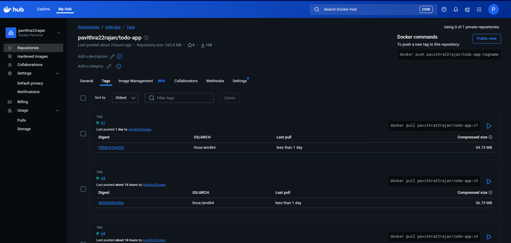
## Deploying the Application on Minikube
```
# Start a minikube cluster
minikube start

# Create a PVC
kubectl apply -f mongo-pvc.yaml

# Create a pod to store the data
kubectl apply -f mongo-deployment.yaml

# Internal service for MongoDB as ClusterIP
kubectl apply -f mongo-service.yaml

# deploy the Flask application using the image pushed above with same name
kubectl apply -f flask-deployment.yaml

# create a Node port for external access
kubectl apply -f flask-service.yaml

# View all pods
kubectl get all

# To get the service URL to access
minikube service flask-todo-service --url

# Search on selector type
kubectl get pods -l tier=frontend

# to know what port type and IP
kubectl get svc flask-todo-service

# logs per pod  
kubectl logs -f flask-todo-deployment-b7fb88598-fksqb
```

### Service details
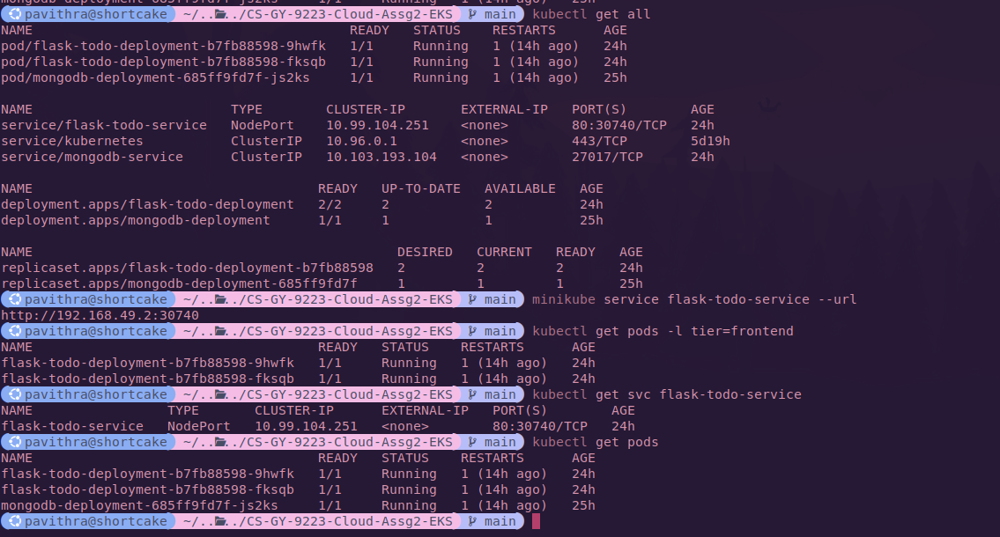

### Frontend replica details


### Deleting a pod 
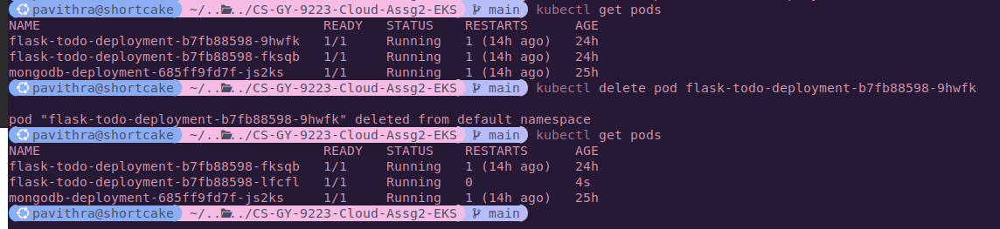

## Deploying the Application on AWS EKS
- Create a custom EKS cluster in AWS
    - **create Cluster IAM role:** This is the most critical IAM role for the EKS cluster itself. The EKS control plane (the Kubernetes master components) needs permission to call AWS APIs on your behalf, primarily to manage resources like the EC2 instances that serve as the worker nodes and to create ELBs. When you deploy an LB, the EKS cluster uses its IAM role to ask AWS to provision the new ELB. Without this role, the service will get stuck in a "Pending" state.
   
    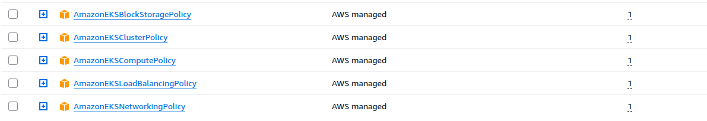

    - **create EKS Node Group IAM Role:** Your worker nodes (EC2 instances) also need an IAM role. This role grants the worker nodes permissions to join the EKS cluster, pull Docker images from AWS ECR (Elastic Container Registry), send logs and metrics to AWS services like CloudWatch.

    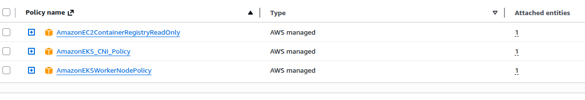

    - Enable Prometheus and CloudWatch
    - Create Pod Identity IAM role for service account
    ```
    {
    "Version": "2012-10-17",
    "Statement": [
        {
        "Effect": "Allow",
        "Principal": {
            "Service": "pods.eks.amazonaws.com"
        },
        "Action": "sts:AssumeRole"
        }
    ]
    }
    ```
### Add-Ons    
| Component | Description | Importance / Role |
|------------|--------------|-------------------|
| **Amazon VPC CNI** | The networking plugin that assigns a private IP address from your VPC to every Pod, enabling Pod-to-Pod and Pod-to-Service communication. | The Flask and MongoDB Pods must be able to communicate, and your LoadBalancer Service needs CNI integration to route traffic. |
| **Kube-proxy** | Maintains network rules on worker nodes and is essential for implementing the Kubernetes Service concept (including  LoadBalancer Service). | **Mandatory.** Installed by default, but ensure it's up-to-date. |
| **CoreDNS** | Provides DNS resolution for service discovery (e.g., resolving `mongodb-service` to its IP). | **Mandatory.** Installed by default, but essential for the Flask app to find MongoDB. |
| **Amazon EBS CSI Driver** | Allows Kubernetes to provision and manage AWS EBS volumes dynamically. | **Required for Persistence.** This handles the underlying storage for your PersistentVolumeClaim that MongoDB uses. |
| **AWS Load Balancer Controller** | Manages AWS Application and Network Load Balancers. | **Recommended.** While the standard LoadBalancer Service works, this controller gives you more advanced and cost-effective traffic management. |

### Issues with eksconfig
- access denied exceptions
```
aws eks update-kubeconfig --region us-east-1 --name todo-app-v1
```
```
An error occurred (AccessDeniedException) when calling the DescribeCluster operation: User: arn:aws:iam::<redacted id>:user/<redacted user> is not authorized to perform: eks:DescribeCluster on resource: arn:aws:eks:us-east-1:<redacted>>:cluster/todo-app-v1 because no identity-based policy allows the eks:DescribeCluster action
```
Updated the above user with new inline policy.
```
{
    "Version": "2012-10-17",
    "Statement": [
        {
            "Effect": "Allow",
            "Action": [
                "eks:DescribeCluster",
                "eks:ListClusters",
                "eks:AccessKubernetesApi",
                "eks:ListUpdates",
                "eks:ListNodegroups",
                "eks:DescribeNodegroup"
            ],
            "Resource": "*" 
        },
        {
            "Effect": "Allow",
            "Action": "iam:PassRole",
            "Resource": "*",
            "Condition": {
                "StringEquals": {
                    "iam:PassedToService": "eks.amazonaws.com"
                }
            }
        }
    ]
}
```
- Faced issues in running kubectl commands since the user did not have associated access policy for the cluster. This was fixed by adding an access entry for that user.
```
kubectl get nodes                                              
E1101 22:07:23.974183  174518 memcache.go:265] "Unhandled Error" err="couldn't get current server API group list: the server has asked for the client to provide credentials"
E1101 22:07:25.173634  174518 memcache.go:265] "Unhandled Error" err="couldn't get current server API group list: the server has asked for the client to provide credentials"
E1101 22:07:26.376010  174518 memcache.go:265] "Unhandled Error" err="couldn't get current server API group list: the server has asked for the client to provide credentials"
E1101 22:07:27.604759  174518 memcache.go:265] "Unhandled Error" err="couldn't get current server API group list: the server has asked for the client to provide credentials"
E1101 22:07:28.914333  174518 memcache.go:265] "Unhandled Error" err="couldn't get current server API group list: the server has asked for the client to provide credentials"
error: You must be logged in to the server (the server has asked for the client to provide credentials)
```

- Issue with the ExternalIP being <none> was fixed by changing the spec type.
```
kubectl patch svc flask-todo-service -p '{"spec": {"type": "LoadBalancer"}}'
```
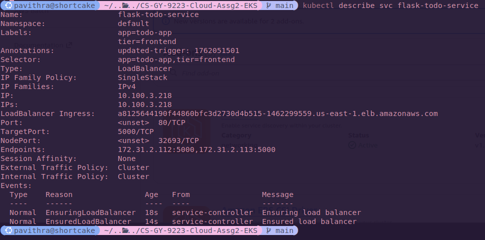
- Modified IAM policy of user to have `iam*` and `cloudformation*` owing to the below authorization issues.
```
Error: describing CloudFormation stacks for "todo-app-v1": operation error CloudFormation: ListStacks, https response error StatusCode: 403, RequestID: 7cf352a6-cd42-46c5-b392-394924fb67cb, api error AccessDenied: User: arn:aws:iam::<redacted>:user/<redacted user> is not authorized to perform: cloudformation:ListStacks on resource: arn:aws:cloudformation:us-east-1:<redacted>:stack/*/* because no identity-based policy allows the cloudformation:ListStacks action
```
### Service account creation
```
eksctl utils associate-iam-oidc-provider --region=us-east-1 --cluster=todo-app-v1 --approve
2025-11-01 23:49:16 [ℹ]  will create IAM Open ID Connect provider for cluster "todo-app-v1" in "us-east-1"
2025-11-01 23:49:16 [✔]  created IAM Open ID Connect provider for cluster "todo-app-v1" in "us-east-1"
```
```
eksctl create iamserviceaccount \
    --cluster=todo-app-v1 \
    --namespace=kube-system \
    --name=ebs-csi-controller-sa \
    --attach-policy-arn=arn:aws:iam::aws:policy/service-role/AmazonEBSCSIDriverPolicy \
    --override-existing-serviceaccounts \
    --approve
```
### Issues with PVC
- created a storage class `gp2-eks` and added that to `mongo-pvc`
- applied the storage class followed by the pvc
```
kubectl get storageclass                  

NAME      PROVISIONER                 RECLAIMPOLICY   VOLUMEBINDINGMODE      ALLOWVOLUMEEXPANSION   AGE
gp2       kubernetes.io/aws-ebs       Delete          WaitForFirstConsumer   false                  5h29m
gp2-eks   ebs.csi.eks.amazonaws.com   Delete          WaitForFirstConsumer   false                  2m58s
```
These were the errors encountered. 
```
running PreFilter plugin "VolumeBinding": error getting PVC "default/mongodb-pvc": could not find v1.PersistentVolumeClaim "default/mongodb-pvc"
```
```
Warning  FailedScheduling  97s (x2 over 6m37s)  eks-auto-mode/compute  Failed to schedule pod, unbound pvc must define a storage class (PersistentVolumeClaim=default/mongodb-pvc, StorageClass=)
```
```
ebs.csi.aws.com_ebs-csi-controller-6b4ccb9d98-2fz8g_2e54ed5a-3a44-4004-b942-18ea7fad59c3  failed to provision volume with StorageClass "gp2": error generating accessibility requirements: no topology key found on CSINode i-01e211b4f767940fa
```
This was fixed with:
```
kubectl apply -f gp2-eks-sc.yaml
```
## Deployments and ReplicaSets
- Specified the replicas in `spec.replica` in `flask-deployment.yaml`.
- Deploy the changes and check the replica details with `kubectl get rs`. We can see the DESIRED, CURRENT and READY replicas.
- scale-up to have 5 replicas via `kubectl`.
- scale-down back to 2 replicas.
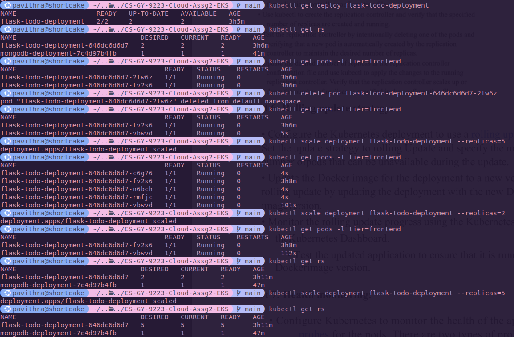
## Rolling update strategy
- Made a minor change to the `app.py` to build a new image. This was by adding a space in the header of the application. 
- Build the image and push it. 
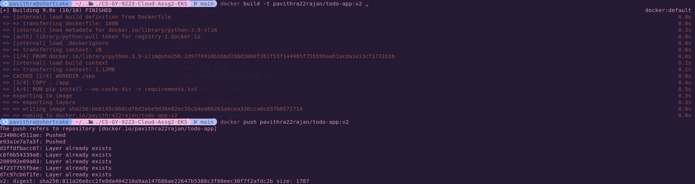
- Make changes to `flask-deployment.yaml` to have the right tag.
- The status can be monitored with `kubectl. 

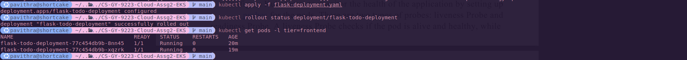
## Health monitoring
- Added liveness and readiness probe to `flask-deployment.yaml`. 
### Readiness probe
- Added a `sys.exit` in `\list` endpoint and re-applied the changes.

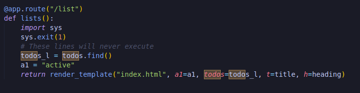
- Similarly, did the above for `\` root endpoint. Here, we can see that the pod keeps restarting. 
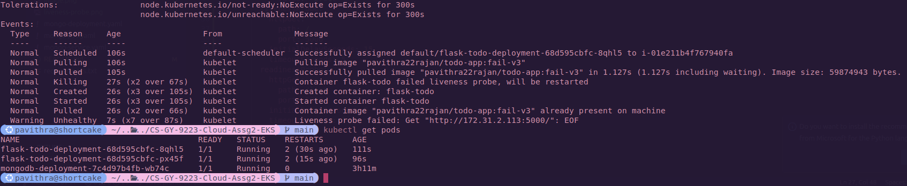
## Alerting
```
kubectl create secret generic prometheus-kube-prometheus-alertmanager -n monitoring --from-file=alertmanager.yaml=alertmanager.yaml 
```
```
helm upgrade --install prometheus prometheus-community/kube-prometheus-stack --namespace monitoring \
    --set alertmanager.enabled=true \
    --set alertmanager.alertmanagerSpec.routePrefix=/ \
    --set alertmanager.ingress.enabled=false \
    --set prometheus.prometheusSpec.serviceMonitorSelectorNilUsesHelmValues=false \
    --set prometheus.prometheusSpec.podMonitorSelectorNilUsesHelmValues=false
```
```
kubectl get statefulset -n monitoring
NAME                                                   READY   AGE
alertmanager-prometheus-kube-prometheus-alertmanager   1/1     24m
prometheus-prometheus-kube-prometheus-prometheus       1/1     24m
```
```
kubectl rollout restart statefulset alertmanager-prometheus-kube-prometheus-alertmanager -n monitoring
```
```
kubectl apply -f alert-rule.yaml 
prometheusrule.monitoring.coreos.com/flask-health-alert created
```
- Created a new Slack App and added the hook URL in `alertmanager.yaml` which is passed as an environment variable.
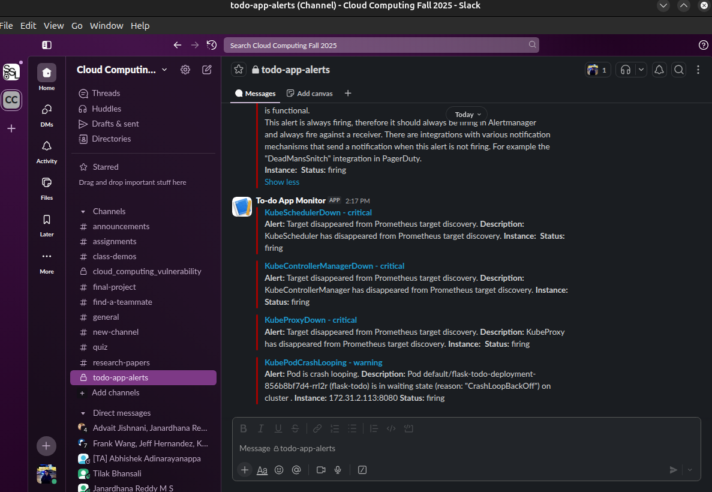

- Used the same scenario as of liveness probe to trigger failures. As seen above, a message is sent to alert a pod in crashing loop. 
- After re-deploying the flask application, a message is sent to indicate that the event has resolved. 
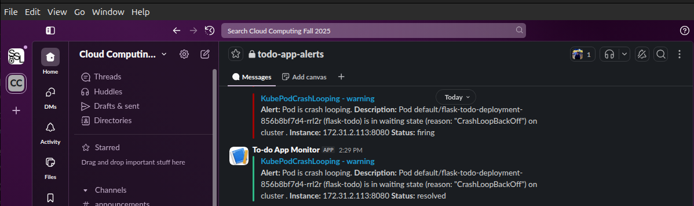
