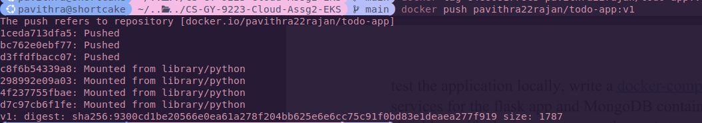
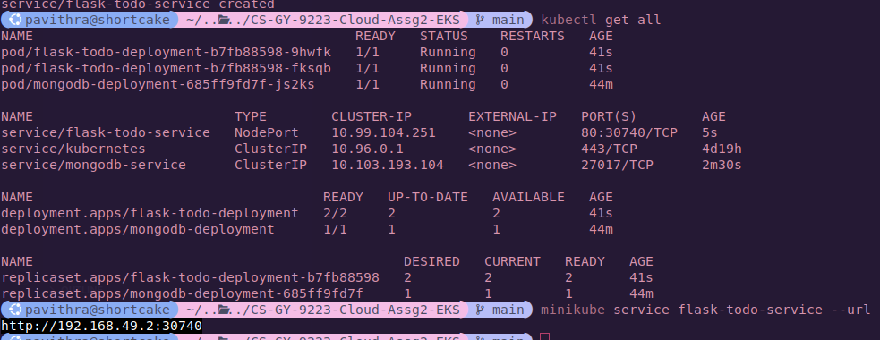
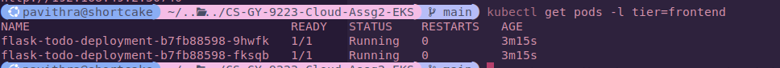

# CS-GY-9223-Cloud-Assg2-EKS
This repository contains the codebase for CS-GY 9223 Cloud Computing Assignment 2 dealing with EKS, Docker and deployments

## Set Up
- Install Docker [for Ubuntu via apt](https://docs.docker.com/engine/install/ubuntu/#install-using-the-repository)
- Install minikube [via Binary](https://minikube.sigs.k8s.io/docs/start/?arch=%2Flinux%2Fx86-64%2Fstable%2Fbinary+download)

- Install kubectl
```
curl -LO "https://dl.k8s.io/release/$(curl -L -s https://dl.k8s.io/release/stable.txt)/bin/linux/amd64/kubectl"
chmod +x kubectl
```

## Containerizing the Application on Docker
- Create `Dockerfile` and docker compose YAML
    - Dockerfile specifies the steps to be taken for a single container image.
    - Docker compose is for running and orchestrating multiple images. 
### Issues faced
1. Dependency issues `ImportError: cannot import name 'url_quote' from 'werkzeug.urls`
2. Updated requirements.txt with version pinning.
3, 

### Docker compose commands
```
docker compose build
docker compose up -d
docker compose logs mongodb
docker compose logs web
docker compose down -v
docker image prune -f
```
### Pushing image to DockerHub


## Deploying the Application on Minikube
```
# Start a minikube cluster
minikube start

# Create a PVC
kubectl apply -f mongo-pvc.yaml

# Create a pod to store the data
kubectl apply -f mongo-deployment.yaml

# Internal service for MongoDB as ClusterIP
kubectl apply -f mongo-service.yaml

# deploy the Flask application using the image pushed above with same name
kubectl apply -f flask-deployment.yaml

# create a Node port for external access
kubectl apply -f flask-service.yaml

# View all pods
kubectl get all

# To get the service URL to access
minikube service flask-todo-service --url

# Search on selector type
kubectl get pods -l tier=frontend

# to know what port type and IP
kubectl get svc flask-todo-service

# logs per pod  
kubectl logs -f flask-todo-deployment-b7fb88598-fksqb
```

### Service details


### Frontend replica details
