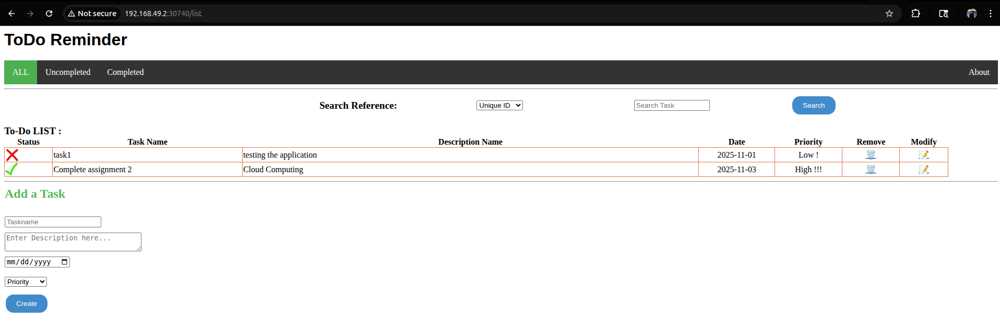

# Assignment 2 - CS-GY 9223 Cloud Computing
### Submitted by Pavithra Rajan (pr2725)

## Task 1 and 2: Containerizing the Application on Docker
- Create `Dockerfile` and `docker-compose.yaml`

### Docker compose commands
```
docker compose build
docker compose up -d
docker compose logs mongodb
docker compose logs web
```
### Pushing image to DockerHub


## Task 3: Deploying the Application on Minikube
```
# Start a minikube cluster
minikube start

# Create a PVC
kubectl apply -f mongo-pvc.yaml

# Create a pod to store the data
kubectl apply -f mongo-deployment.yaml

# Internal service for MongoDB as ClusterIP
kubectl apply -f mongo-service.yaml

# deploy the Flask application using the image pushed above with same name
kubectl apply -f flask-deployment.yaml

# create a Node port for external access
kubectl apply -f flask-service.yaml

# View all pods
kubectl get all

# To get the service URL to access
minikube service flask-todo-service --url

# Search on selector type
kubectl get pods -l tier=frontend

# to know what port type and IP
kubectl get svc flask-todo-service

# logs per pod  
kubectl logs -f flask-todo-deployment-b7fb88598-fksqb
```

### Service details


### Frontend replica details


### Deleting a pod 


### Running local instance

## Task 4: Deploying the Application on AWS EKS
- Create a custom EKS cluster in AWS
    - **create Cluster IAM role:** This is the most critical IAM role for the EKS cluster itself. The EKS control plane (the Kubernetes master components) needs permission to call AWS APIs on your behalf, primarily to manage resources like the EC2 instances that serve as the worker nodes and to create ELBs. When you deploy an LB, the EKS cluster uses its IAM role to ask AWS to provision the new ELB. Without this role, the service will get stuck in a "Pending" state.
   
    

    - **create EKS Node Group IAM Role:** The worker nodes (EC2 instances) also need an IAM role. This role grants the worker nodes permissions to join the EKS cluster, pull Docker images from AWS ECR (Elastic Container Registry), send logs and metrics to AWS services like CloudWatch.

    

    - Enable Prometheus and CloudWatch
    - Create Pod Identity IAM role for service account
    ```
    {
    "Version": "2012-10-17",
    "Statement": [
        {
        "Effect": "Allow",
        "Principal": {
            "Service": "pods.eks.amazonaws.com"
        },
        "Action": "sts:AssumeRole"
        }
    ]
    }
    ```
### EKSConfig

```
aws eks update-kubeconfig --region us-east-1 --name todo-app-v1
```

Updated the above user with new inline policy.
```
{
    "Version": "2012-10-17",
    "Statement": [
        {
            "Effect": "Allow",
            "Action": [
                "eks:DescribeCluster",
                "eks:ListClusters",
                "eks:AccessKubernetesApi",
                "eks:ListUpdates",
                "eks:ListNodegroups",
                "eks:DescribeNodegroup"
            ],
            "Resource": "*" 
        },
        {
            "Effect": "Allow",
            "Action": "iam:PassRole",
            "Resource": "*",
            "Condition": {
                "StringEquals": {
                    "iam:PassedToService": "eks.amazonaws.com"
                }
            }
        }
    ]
}
```
- Set the service spec type as `LoadBalancer`.
```
kubectl patch svc flask-todo-service -p '{"spec": {"type": "LoadBalancer"}}'
```

- Modified IAM policy of user to have `iam*` and `cloudformation*` owing to authorization issues.

### Service account creation
```
eksctl utils associate-iam-oidc-provider --region=us-east-1 --cluster=todo-app-v1 --approve
2025-11-01 23:49:16 [ℹ]  will create IAM Open ID Connect provider for cluster "todo-app-v1" in "us-east-1"
2025-11-01 23:49:16 [✔]  created IAM Open ID Connect provider for cluster "todo-app-v1" in "us-east-1"
```
```
eksctl create iamserviceaccount \
    --cluster=todo-app-v1 \
    --namespace=kube-system \
    --name=ebs-csi-controller-sa \
    --attach-policy-arn=arn:aws:iam::aws:policy/service-role/AmazonEBSCSIDriverPolicy \
    --override-existing-serviceaccounts \
    --approve
```
### Storage Class for PVC
- created a storage class `gp2-eks` and added that to `mongo-pvc`
- applied the storage class followed by the pvc
```
kubectl get storageclass                  

NAME      PROVISIONER                 RECLAIMPOLICY   VOLUMEBINDINGMODE      ALLOWVOLUMEEXPANSION   AGE
gp2       kubernetes.io/aws-ebs       Delete          WaitForFirstConsumer   false                  5h29m
gp2-eks   ebs.csi.eks.amazonaws.com   Delete          WaitForFirstConsumer   false                  2m58s
```
```
kubectl apply -f gp2-eks-sc.yaml
```

## Task 5: Deployments and ReplicaSets
- Specified the replicas in `spec.replica` in `flask-deployment.yaml`.
- Deploy the changes and check the replica details with `kubectl get rs`. We can see the DESIRED, CURRENT and READY replicas.
- scale-up to have 5 replicas via `kubectl`.
- scale-down back to 2 replicas.


## Task 6: Rolling update strategy
- Made a minor change to the `app.py` to build a new image. This was by adding a space in the header of the application. 
- Build the image and push it. 

- Make changes to `flask-deployment.yaml` to have the right tag.
- The status can be monitored with `kubectl`. 


## Task 7: Health monitoring
- Added liveness and readiness probe to `flask-deployment.yaml`. 
### Readiness probe
- Added a `sys.exit` in `/list` endpoint and re-applied the changes.


### Liveness probe
- Similarly, did the above for `/` root endpoint. Here, we can see that the pod keeps restarting. 


## Task 8: Alerting [Extra Credit]
```
kubectl create secret generic prometheus-kube-prometheus-alertmanager -n monitoring --from-file=alertmanager.yaml=alertmanager.yaml 
```
```
helm upgrade --install prometheus prometheus-community/kube-prometheus-stack --namespace monitoring \
    --set alertmanager.enabled=true \
    --set alertmanager.alertmanagerSpec.routePrefix=/ \
    --set alertmanager.ingress.enabled=false \
    --set prometheus.prometheusSpec.serviceMonitorSelectorNilUsesHelmValues=false \
    --set prometheus.prometheusSpec.podMonitorSelectorNilUsesHelmValues=false
```
```
kubectl get statefulset -n monitoring
NAME                                                   READY   AGE
alertmanager-prometheus-kube-prometheus-alertmanager   1/1     24m
prometheus-prometheus-kube-prometheus-prometheus       1/1     24m
```
```
kubectl rollout restart statefulset alertmanager-prometheus-kube-prometheus-alertmanager -n monitoring
```
```
kubectl apply -f alert-rule.yaml 
prometheusrule.monitoring.coreos.com/flask-health-alert created
```
- Created a new Slack App and added the hook URL in `alertmanager.yaml` which is passed as an environment variable.


- Used the same scenario as of liveness probe to trigger failures. As seen above, a message is sent to alert a pod in crashing loop. 
- After re-deploying the flask application, a message is sent to indicate that the event has resolved. 

